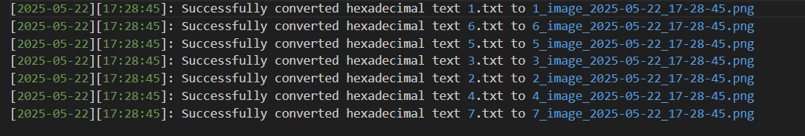

# Praktikum Sistem Operasi Modul 4 - IT17

## Anggota Kelompok

| NRP        | Nama                            |
|:----------:|:-------------------------------:|
| 5027241006 | Nabilah Anindya Paramesti       |
| 5027241092 | Muhammad Khairul Yahya          |
| 5027241002 | Balqis Sani Sabillah            |


## Daftar Isi

- [Soal 1](#soal-1)
- [Soal 2](#soal-2)
- [Soal 3](#soal-3)

# Soal 1
_**Oleh : Nabilah Anindya Paramesti**_

## Deskripsi Soal
Suatu hari, saat di Tethys' Deep, Shorekeeper menemukan sebuah anomali yang baru diketahui. Anomali ini berupa sebuah teks acak yang kelihatannya tidak memiliki arti. Namun, ia mempunyai ide untuk mencari arti dari teks acak tersebut.

## Kesimpulan soal
### Tujuan Program
1. **Mengambil sampel anomali teks**  
   Program harus mengunduh file ZIP yang berisi sampel teks dari sebuah link dan mengekstraknya. Setelah ekstraksi selesai, file ZIP harus dihapus.

2. **Identifikasi Format Teks**  
   Teks yang diambil dalam file ZIP adalah dalam format hexadecimal.

3. **Konversi Hexadecimal ke Gambar**  
   Program harus mengubah string hexadecimal dalam teks menjadi sebuah file gambar.

4. **Penamaan File Gambar**  
   Penamaan file gambar yang dihasilkan dari konversi harus mengikuti format berikut:  
   `[nama file string]image[YYYY-mm-dd]_[HH:MM:SS].png`

   Contoh:  
    `1_image_2025-05-11_18:35:26.png`

5. **Menyimpan Gambar di Folder "image"**  
    Gambar yang dihasilkan dari konversi harus disimpan di dalam folder bernama `image`.

6. **Pencatatan ke dalam Log**  
    Setiap proses konversi harus dicatat dalam file log bernama `conversion.log` dengan format berikut:  
    `[YYYY-mm-dd][HH:MM:SS]: Successfully converted hexadecimal text [nama file string] to [nama file image].`

    Contoh log:  
    `[2025-05-11][18:35:26]: Successfully converted hexadecimal text 1.txt to 1_image_2025-05-11_18:35:26.png.`


7.  Fitur Program
    - Membaca file teks dengan format hexadecimal.
    - Mengubah hexadecimal ke format gambar.
    - Menyimpan gambar di folder yang benar.
    - Menghapus file ZIP setelah proses unzip.
    - Menulis log dengan informasi konversi.


## Penjelasan


# Penjelasan Kode dengan Code

Kode ini mengimplementasikan aplikasi FUSE (Filesystem in Userspace) sederhana untuk mengonversi string hexadecimal dalam file `.txt` menjadi gambar PNG. Program ini juga mencatat setiap konversi dan membuat gambar keluaran dalam folder tertentu. Berikut adalah penjelasan rinci mengenai setiap fungsi dan cara kerja program, dengan kode yang disertakan di setiap penjelasan.

## Rincian Fungsi

### 1. **`set_dirpath`**
   - **Tujuan**: Untuk mendapatkan direktori kerja saat ini dan menambahkan folder `/anomali` ke dalamnya.
   - **Cara Kerja**: 
     - Fungsi ini menggunakan `getcwd()` untuk mengambil direktori saat ini dan menambahkan `/anomali` ke dalamnya. 
     - Path yang dihasilkan disimpan dalam `dirpath`, yang akan digunakan untuk mengakses file di sistem file FUSE.

   ```c
   void set_dirpath() {
       if (getcwd(cwd, sizeof(cwd)) != NULL) {
           // Gabungkan dengan folder 'anomali'
           strcat(cwd, "/anomali");
           dirpath = cwd;  // Assign direktori yang sudah digabung ke dirpath
       } else {
           perror("getcwd() error");
           exit(1);  // Keluar jika gagal mendapatkan direktori saat ini
       }
   }
   ```

### 2. **`download_and_extract_files`**
   - **Tujuan**: Untuk mengunduh file ZIP dari Google Drive, mengekstraknya, dan menghapus file ZIP yang asli.
   - **Cara Kerja**:
     - Fungsi ini menggunakan fungsi `system()` untuk menjalankan perintah shell:
       - `wget` digunakan untuk mengunduh file dari Google Drive.
       - `unzip` digunakan untuk mengekstrak isi file ZIP.
       - Setelah itu, `rm` digunakan untuk menghapus file ZIP setelah ekstraksi selesai.

   ```c
   void download_and_extract_files() {
       // Unduh file zip dari Google Drive
       system("wget --no-check-certificate "https://drive.usercontent.google.com/u/0/uc?id=1hi_GDdP51Kn2JJMw02WmCOxuc3qrXzh5&export=download" -O anomali.zip");

       // Ekstrak file zip
       system("unzip anomali.zip");

       // Hapus file zip setelah ekstraksi selesai
       system("rm anomali.zip");
   }
   ```

### 3. **`ensure_output_folder_exists`**
   - **Tujuan**: Untuk memastikan folder `anomali/image` ada tempat menyimpan gambar hasil konversi.
   - **Cara Kerja**:
     - Fungsi ini memeriksa apakah folder `anomali/image` ada menggunakan `stat()`. 
     - Jika folder tersebut tidak ada, maka dibuat dengan perintah `mkdir()`.

   ```c
   void ensure_output_folder_exists() {
       struct stat st = {0};
       if (stat(OUTPUT_FOLDER, &st) == -1) {
           mkdir(OUTPUT_FOLDER, 0755);
       }
   }
   ```

### 4. **`ensure_anomali_folder_exists`**
   - **Tujuan**: Untuk memastikan folder `anomali` dan subfolder `anomali/image` ada.
   - **Cara Kerja**:
     - Fungsi ini memeriksa dan membuat folder yang diperlukan jika belum ada, sama seperti fungsi `ensure_output_folder_exists`.

   ```c
   void ensure_anomali_folder_exists() {
       struct stat st = {0};
       if (stat("anomali", &st) == -1) {
           mkdir("anomali", 0755);  // Membuat folder 'anomali' jika belum ada
       }

       if (stat(OUTPUT_FOLDER, &st) == -1) {
           mkdir(OUTPUT_FOLDER, 0755);  // Membuat folder 'image' jika belum ada
       }
   }
   ```

### 5. **`get_current_time_str`**
   - **Tujuan**: Untuk mendapatkan tanggal dan waktu saat ini dalam format tertentu (`YYYY-MM-DD` untuk tanggal, `HH:MM:SS` untuk waktu).
   - **Cara Kerja**:
     - Fungsi ini menggunakan `time()` dan `localtime()` untuk mengambil waktu saat ini.
     - Kemudian, `strftime()` digunakan untuk memformat waktu sesuai dengan format yang diinginkan.

   ```c
   void get_current_time_str(char *date_str, char *time_str) {
       time_t now = time(NULL);
       struct tm *t = localtime(&now);
       strftime(date_str, 11, "%Y-%m-%d", t);   // YYYY-MM-DD
       strftime(time_str, 9, "%H:%M:%S", t);    // HH:MM:SS
   }
   ```

### 6. **`hex_to_val`**
   - **Tujuan**: Untuk mengonversi karakter hexadecimal menjadi nilai byte yang sesuai.
   - **Cara Kerja**:
     - Fungsi ini memeriksa apakah karakter tersebut adalah digit hexadecimal yang valid (0-9, a-f, A-F) dan mengembalikannya sebagai nilai integer. 
     - Jika karakter tidak valid, maka fungsi ini mengembalikan nilai `-1`.

   ```c
   int hex_to_val(char c) {
       if (c >= '0' && c <= '9') return c - '0';
       if (c >= 'a' && c <= 'f') return c - 'a' + 10;
       if (c >= 'A' && c <= 'F') return c - 'A' + 10;
       return -1;
   }
   ```

### 7. **`convert_hex_to_binary`**
   - **Tujuan**: Untuk mengonversi string hexadecimal menjadi data biner (array byte).
   - **Cara Kerja**:
     - Fungsi ini memproses setiap dua karakter dalam string hexadecimal dan mengonversinya menjadi satu byte menggunakan `strtol()`.
     - Byte tersebut disimpan dalam array `binary_data`, dan jumlah byte yang dihasilkan disimpan dalam `binary_size`.

   ```c
   void convert_hex_to_binary(const char *hex_string, unsigned char *binary_data, size_t *binary_size) {
       size_t len = strlen(hex_string);
       *binary_size = len / 2;

       for (size_t i = 0; i < *binary_size; i++) {
           char hex_byte[3] = {hex_string[2 * i], hex_string[2 * i + 1], ' '};
           binary_data[i] = (unsigned char)strtol(hex_byte, NULL, 16);
       }
   }
   ```

### 8. **`convert_binary_to_image`**
   - **Tujuan**: Untuk menyimpan data biner sebagai file PNG.
   - **Cara Kerja**:
     - Fungsi ini menulis array `binary_data` ke dalam file menggunakan `fwrite()`. File output dibuat pada path yang ditentukan oleh `output_path`.

   ```c
   void convert_binary_to_image(const unsigned char *binary_data, size_t binary_size, const char *output_path) {
       FILE *fp = fopen(output_path, "wb");
       if (fp == NULL) {
           perror("fopen() error");
           return;
       }

       fwrite(binary_data, 1, binary_size, fp);
       fclose(fp);
   }
   ```

### 9. **`log_conversion`**
   - **Tujuan**: Untuk mencatat detail konversi ke dalam file log (`conversion.log`).
   - **Cara Kerja**:
     - Fungsi ini menulis timestamp konversi, nama file sumber, dan path file output ke dalam file log.
     - `get_current_time_str` digunakan untuk memformat tanggal dan waktu saat ini.
     - File log dibuka dalam mode append dan log ditulis ke dalamnya.

   ```c
   void log_conversion(const char *file_name, const char *output_image_path) {
       FILE *log_file = fopen(LOG_FILE, "a");
       if (log_file == NULL) {
           perror("Failed to open log file for writing");
           return;
       }

       char date_str[11], time_str[9];
       get_current_time_str(date_str, time_str);

       fprintf(log_file, "[%s][%s]: Successfully converted hexadecimal text %s to %s
",
               date_str, time_str, file_name, output_image_path);

       if (fclose(log_file) != 0) {
           perror("Error closing log file");
       }
   }
   ```

### 10. **`xmp_getattr`**
   - **Tujuan**: Untuk mengambil atribut file (misalnya ukuran, izin) dari file yang diminta.
   - **Cara Kerja**:
     - Fungsi ini membangun path lengkap ke file menggunakan `dirpath` dan `path`.
     - Kemudian, `lstat()` digunakan untuk mendapatkan atribut file. Jika gagal, fungsi ini mengembalikan error.

   ```c
   static int xmp_getattr(const char *path, struct stat *stbuf) {
       int res;
       char fpath[1000];

       sprintf(fpath, "%s%s", dirpath, path);

       res = lstat(fpath, stbuf);

       if (res == -1) return -errno;

       return 0;
   }
   ```

### 11. **`xmp_readdir`**
   - **Tujuan**: Untuk membaca isi dari sebuah direktori.
   - **Cara Kerja**:
     - Fungsi ini memeriksa apakah `path` adalah direktori root (`/`), kemudian membuka direktori dengan `opendir()`.
     - Setiap entri dalam direktori dibaca menggunakan `readdir()` dan diteruskan ke `filler`, yang bertanggung jawab untuk mengisi daftar direktori.
     - Fungsi ini mengembalikan `0` setelah selesai membaca semua entri direktori.

   ```c
   static int xmp_readdir(const char *path, void *buf, fuse_fill_dir_t filler, off_t offset, struct fuse_file_info *fi) {
       char fpath[1000];

       if (strcmp(path, "/") == 0) {
           path = dirpath;
           sprintf(fpath, "%s", path);
       } else {
           sprintf(fpath, "%s%s", dirpath, path);
       }

       int res = 0;

       DIR *dp;
       struct dirent *de;
       (void) offset;
       (void) fi;

       dp = opendir(fpath);

       if (dp == NULL) return -errno;

       while ((de = readdir(dp)) != NULL) {
           struct stat st;

           memset(&st, 0, sizeof(st));

           st.st_ino = de->d_ino;
           st.st_mode = de->d_type << 12;
           res = (filler(buf, de->d_name, &st, 0));

           if (res != 0) break;
       }

       closedir(dp);

       return 0;
   }
   ```

### 12. **`xmp_read`**
   - **Tujuan**: Untuk membaca isi file dan mengonversinya jika file tersebut adalah file `.txt` yang berisi data hexadecimal.
   - **Cara Kerja**:
     - Fungsi ini memeriksa apakah file yang dibaca adalah file `.txt`.
     - Jika ya, fungsi ini membaca isinya dan mengonversi string hexadecimal menjadi data biner menggunakan `convert_hex_to_binary()`.
     - Data biner kemudian dikonversi menjadi file PNG menggunakan `convert_binary_to_image()`.
     - Setelah konversi selesai, log ditulis menggunakan `log_conversion()`.

   ```c
   static int xmp_read(const char *path, char *buf, size_t size, off_t offset, struct fuse_file_info *fi) {
       printf("Reading file: %s
", path);

       char fpath[1000];
       if (strcmp(path, "/") == 0) {
           path = dirpath;
           sprintf(fpath, "%s", path);
       } else {
           sprintf(fpath, "%s%s", dirpath, path);
       }

       int res = 0;
       int fd = 0;

       (void) fi;

       fd = open(fpath, O_RDONLY);

       if (fd == -1) return -errno;

       res = pread(fd, buf, size, offset);

       if (res == -1) res = -errno;

       // Debug: Check if file is a .txt file and attempt conversion
       if (strstr(path, ".txt") != NULL) {
           printf("Converting file: %s
", path);

           // Baca isi file .txt
           char hex_string[1024];
           ssize_t bytes_read = read(fd, hex_string, sizeof(hex_string) - 1);
           if (bytes_read < 0) {
               perror("read() error");
               close(fd);
               return -errno;
           }

           hex_string[bytes_read] = ' ';  // Null-terminate the string

           // Memisahkan nama file tanpa ekstensi .txt
           char base_name[1024];
           strncpy(base_name, path + 1, strlen(path) - 4);  // Menghapus ekstensi '.txt' dari nama file

           // Format penamaan gambar yang benar
           char output_image_path[1024];
           char date_str[11], time_str[9];
           get_current_time_str(date_str, time_str);
           sprintf(output_image_path, "%s_image_%s_%s.png", base_name, date_str, time_str); // Format yang benar

           // Tentukan direktori image
           char image_folder[1024];
           snprintf(image_folder, sizeof(image_folder), "%s%s", dirpath, image_dir);

           // Buat folder image jika belum ada
           struct stat st = {0};
           if (stat(image_folder, &st) == -1) {
               mkdir(image_folder, 0700);
           }

           // Tentukan path lengkap untuk gambar
           char full_image_path[1024];
           snprintf(full_image_path, sizeof(full_image_path), "%s/%s", image_folder, output_image_path);

           // Konversi hex ke binary
           unsigned char binary_data[1024];
           size_t binary_size;
           convert_hex_to_binary(hex_string, binary_data, &binary_size);

           // Konversi binary ke gambar
           convert_binary_to_image(binary_data, binary_size, full_image_path);

           // Log konversi
           log_conversion(path, full_image_path);
       }

       close(fd);
       return res;
   }
   ```

### 13. **Struktur Operasi FUSE**
   - **Tujuan**: Untuk mendefinisikan operasi yang didukung oleh filesystem FUSE ini.
   - **Cara Kerja**:
     - Struktur `fuse_operations` berisi pointer fungsi untuk `getattr`, `readdir`, dan `read`.
     - Fungsi-fungsi ini menangani operasi terkait sistem file FUSE (mengambil atribut file, membaca isi direktori, dan membaca isi file).

   ```c
   static struct fuse_operations xmp_oper = {
       .getattr = xmp_getattr,
       .readdir = xmp_readdir,
       .read = xmp_read,
   };
   ```

### 14. **Fungsi `main`**
   - **Tujuan**: Titik masuk utama untuk program, di mana inisialisasi dan pengaturan FUSE dilakukan.
   - **Cara Kerja**:
     - Fungsi ini memastikan folder yang diperlukan ada dengan memanggil `ensure_anomali_folder_exists()`.
     - File diunduh dan diekstrak menggunakan `download_and_extract_files()`.
     - `dirpath` diatur menggunakan `set_dirpath()`.
     - Akhirnya, fungsi ini memulai loop FUSE dengan `fuse_main()`, yang mulai menangani operasi FUSE.

   ```c
   int main(int argc, char *argv[]) {
       printf("Starting program...
");

       // Memastikan folder 'anomali' dan 'anomali/image' ada
       ensure_anomali_folder_exists();

       // Menjalankan fungsi download dan ekstrak file terlebih dahulu
       download_and_extract_files();
       printf("File extraction completed.
");

       // Mengatur dirpath ke direktori saat ini dan folder anomali
       set_dirpath();
       printf("Directory path set.
");

       umask(0);

       // Menjalankan FUSE
       return fuse_main(argc, argv, &xmp_oper, NULL);
   }
   ```

## Alur Eksekusi
1. **Inisialisasi**: Program pertama-tama memastikan folder yang diperlukan (`anomali` dan `anomali/image`) ada dan kemudian mengunduh dan mengekstrak file.
2. **Sistem File FUSE**: Sistem file FUSE kemudian diinisialisasi dan menunggu permintaan operasi file dari pengguna.
3. **Konversi File**: Ketika file `.txt` yang berisi data hexadecimal dibaca, program mengonversi string hex menjadi biner dan kemudian menyimpannya sebagai file PNG.
4. **Logging**: Setiap proses konversi dicatat dengan timestamp, nama file sumber, dan path file output.

## Kesimpulan
Program ini menunjukkan sebuah sistem file FUSE dasar yang memproses file, mengonversi data hexadecimal menjadi biner, dan menyimpannya sebagai gambar. Semua aksi dicatat dalam file log dan folder yang diperlukan dibuat sebelum konversi dilakukan.


## Dokumentasi Revisi





## SOAL 2 ##
_Oleh : Balqis Sani Sabillah_

## Deskripsi Soal ##
Pada suatu hari, seorang ilmuwan muda menemukan sebuah drive tua
yang tertanam di reruntuhan laboratorium robotik. Saat diperiksa, drive
tersebut berisi pecahan data dari satu-satunya robot perawat legendaris
yang dikenal dengan nama Baymax. Sayangnya, akibat kerusakan sistem
selama bertahun-tahun, file utuh Baymax telah terfragmentasi menjadi 14
bagian kecil, masing-masing berukuran 1 kilobyte, dan tersimpan dalam
direktori bernama relics. Pecahan tersebut diberi nama berurutan seperti
Baymax.jpeg.000, Baymax.jpeg.001, hingga Baymax.jpeg.013. Ilmuwan
tersebut kini ingin membangkitkan kembali Baymax ke dalam bentuk digital
yang utuh, namun ia tidak ingin merusak file asli yang telah rapuh tersebut.
(Author : Icel / wonbunsa)

a. Sebagai asisten teknis, tugasmu adalah membuat sebuah
sistem file virtual menggunakan FUSE (Filesystem in
Userspace) yang dapat membantu sang ilmuwan. Buatlah
sebuah direktori mount bernama bebas (misalnya mount_dir)
yang merepresentasikan tampilan Baymax dalam bentuk file
utuh Baymax.jpeg. File sistem tersebut akan mengambil data
dari folder relics sebagai sumber aslinya.

├── mount_dir
├── relics
│ ├── Baymax.jpeg.000
│ ├── Baymax.jpeg.001
│ ├── dst dst…
│ └── Baymax.jpeg.013
└── activity.log

b. Ketika direktori FUSE diakses, pengguna hanya akan melihat
Baymax.jpeg seolah-olah tidak pernah terpecah, meskipun
aslinya terdiri dari potongan .000 hingga .013. File
Baymax.jpeg tersebut dapat dibaca, ditampilkan, dan disalin
sebagaimana file gambar biasa, hasilnya merupakan
gabungan sempurna dari keempat belas pecahan tersebut.

c. Namun sistem ini harus lebih dari sekadar menyatukan. Jika
pengguna membuat file baru di dalam direktori FUSE, maka
sistem harus secara otomatis memecah file tersebut ke dalam
potongan-potongan berukuran maksimal 1 KB, dan
menyimpannya di direktori relics menggunakan format
[namafile].000, [namafile].001, dan seterusnya.

d. Ketika file tersebut dihapus dari direktori mount, semua
pecahannya di relics juga harus ikut dihapus.

e. Untuk keperluan analisis ilmuwan, sistem juga harus mencatat
seluruh aktivitas pengguna dalam sebuah file log bernama
activity.log yang disimpan di direktori yang sama. Aktivitas
yang dicatat antara lain:
- Membaca file (misalnya membuka baymax.png)

- Membuat file baru (termasuk nama file dan jumlah
pecahan)
- Menghapus file (termasuk semua pecahannya yang
terhapus)

- Menyalin file (misalnya cp baymax.png /tmp/)

- Contoh Log :
[2025-05-11 10:24:01] READ: Baymax.jpeg
[2025-05-11 10:25:14] WRITE: hero.txt -> hero.txt.000, hero.txt.001
[2025-05-11 10:26:03] DELETE: Baymax.jpeg.000 - Baymax.jpeg.013
[2025-05-11 10:27:45] COPY: Baymax.jpeg -> /tmp/Baymax.jpeg

## Penjelasan Code ##
```c
void write_log(const char *format, ...) {
    FILE *log = fopen(LOG_FILE, "a");
    if (!log) return;

    time_t now = time(NULL);
    struct tm *t = localtime(&now);
    fprintf(log, "[%04d-%02d-%02d %02d:%02d:%02d] ",
            t->tm_year + 1900, t->tm_mon + 1, t->tm_mday,
            t->tm_hour, t->tm_min, t->tm_sec);

    va_list args;
    va_start(args, format);
    vfprintf(log, format, args);
    va_end(args);

    fprintf(log, "\\n");
    fclose(log);
} 

```
- KETERANGAN 

```write_log``` :
- Fungsi ini menulis entri log ke file yang ditentukan dalam LOG_FILE.
- Setiap entri log diberi timestamp dan diformat sesuai dengan string dan argumen yang diberikan.
- Log file dibuka dalam mode append ("a") agar setiap entri baru ditambahkan di akhir file.

```c
static int baymax_getattr(const char *path, struct stat *stbuf,
                          struct fuse_file_info *fi) {
    memset(stbuf, 0, sizeof(struct stat));
    if (strcmp(path, "/") == 0) {
        stbuf->st_mode = S_IFDIR | 0755;
        stbuf->st_nlink = 2;
    } else if (strcmp(path, "/Baymax.jpeg") == 0) {
        stbuf->st_mode = S_IFREG | 0444;
        stbuf->st_nlink = 1;
        stbuf->st_size = 14 * MAX_FRAGMENT_SIZE;
    } else {
        return -ENOENT;
    }
    return 0;
}
```
- KETERANGAN 
- Fungsi ini digunakan untuk mendapatkan atribut dari file atau direktori.
- Jika path yang diminta adalah /, atribut untuk direktori root dikembalikan (permissions 0755).
- Jika path yang diminta adalah `/Baymax.jpeg`, atribut file tersebut dikembalikan (ditandai sebagai file biasa dengan permission hanya baca dan ukuran 14 fragmen `MAX_FRAGMENT_SIZE)`.
- Jika path yang diminta bukan salah satu dari keduanya, akan mengembalikan -ENOENT, yang berarti "File atau direktori tidak ada."

```c
static int baymax_readdir(const char *path, void *buf, fuse_fill_dir_t filler,
                          off_t offset, struct fuse_file_info *fi,
                          enum fuse_readdir_flags flags) {
    if (strcmp(path, "/") != 0)
        return -ENOENT;

    filler(buf, ".", NULL, 0, 0);
    filler(buf, "..", NULL, 0, 0);
    filler(buf, "Baymax.jpeg", NULL, 0, 0);
    return 0;
}
```
- KETERANGAN 
- Fungsi ini menangani operasi pembacaan direktori. Fungsi ini akan mengembalikan daftar isi dari direktori root (/).
- Direktori root hanya berisi file . (direktori saat ini), .. (direktori induk), dan ` Baymax.jpeg.`

```c
static int baymax_open(const char *path, struct fuse_file_info *fi) {
    if (strcmp(path, "/Baymax.jpeg") != 0)
        return -ENOENT;
    if ((fi->flags & O_ACCMODE) != O_RDONLY)
        return -EACCES;
    write_log("READ: Baymax.jpeg");
    return 0;
}
```
- KETERANGAN 
- Fungsi ini menangani permintaan untuk membuka file.
- Jika path yang diminta adalah /Baymax.jpeg, akan memeriksa apakah file dibuka dalam mode hanya baca (O_RDONLY), karena hanya mode ini yang diizinkan.
- Jika file dibuka dengan benar, entri log dibuat yang mencatat file tersebut dibaca.

```c
static int baymax_read(const char *path, char *buf, size_t size, off_t offset,
                       struct fuse_file_info *fi) {
    if (strcmp(path, "/Baymax.jpeg") != 0)
        return -ENOENT;

```
- KETERANGAN
- Fungsi ini bertanggung jawab untuk membaca data dari file Baymax.jpeg.
- Karena file ini dipecah menjadi beberapa fragmen, fungsi ini membaca data dari fragmen-fragmen tersebut sesuai dengan offset dan size yang diberikan.
- Jika bagian dari file yang diminta belum dibaca, fungsi ini akan melewati fragmen yang belum dibaca hingga menemukan data yang diminta.

```c
static int baymax_create(const char *path, mode_t mode,
                         struct fuse_file_info *fi) {
    char fullpath[512];
    snprintf(fullpath, sizeof(fullpath), "%s%s", `RELICS_DIR`, path);
    FILE *fp = fopen(fullpath, "wb");
    if (!fp) return -EACCES;
    fclose(fp);
    return 0;
}
```
- KETERANGAN 
- Fungsi ini menangani pembuatan file baru dalam sistem file.
- Jika path file valid, fungsi ini akan membuat file kosong di dalam direktori `RELICS_DIR`.

```c
static int baymax_write(const char *path, const char *buf, size_t size,
                        off_t offset, struct fuse_file_info *fi) {
    char filename[256];
    sscanf(path, "/%[^/\\n]", filename);

    int count = 0;
    for (size_t i = 0; i < size; i += MAX_FRAGMENT_SIZE) {
        char frag_path[512];
        snprintf(frag_path, sizeof(frag_path), "%s/%s.%03d", RELICS_DIR, filename, count);
        FILE *frag = fopen(frag_path, "wb");
        if (!frag) return -EIO;
        size_t to_write = size - i > MAX_FRAGMENT_SIZE ? MAX_FRAGMENT_SIZE : size - i;
        fwrite(buf + i, 1, to_write, frag);
        fclose(frag);
        count++;
    }

    write_log("WRITE: %s ->", filename);
    for (int i = 0; i < count; i++)
        write_log("%s.%03d", filename, i);
    return size;
}
```
- KETERANGAN 
- Fungsi ini bertanggung jawab untuk menulis data ke dalam sistem file.
- Data ditulis dalam bentuk fragmen, dengan setiap fragmen berupa file terpisah. Fragmen tersebut dinamai Baymax.jpeg.000, Baymax.jpeg.001, dan seterusnya.
- Data ditulis dalam chunk dengan ukuran MAX_FRAGMENT_SIZE (1024 byte).
- Setelah data ditulis, entri log dibuat yang mencatat nama file dan fragmen yang ditulis.

```c
static int baymax_unlink(const char *path) {
    char filename[256];
    sscanf(path, "/%[^/\\n]", filename);

    char deleted[1024] = "";
    for (int i = 0;; i++) {
        char frag_path[512];
        snprintf(frag_path, sizeof(frag_path), "%s/%s.%03d", RELICS_DIR, filename, i);
        if (access(frag_path, F_OK) == -1) break;
        remove(frag_path);
        strcat(deleted, frag_path);
        strcat(deleted, " ");
    }
    write_log("DELETE: %s", deleted);
    return 0;
}
```
- KETERANGAN 
- Fungsi ini menangani penghapusan file.
- Semua fragmen dari file yang diminta (misalnya Baymax.jpeg) dihapus.
- Fungsi ini akan menghapus setiap fragmen satu per satu dan mencatatnya di dalam log.

# S̵̙͕̀̃o̯̱̊͊͢ā̤̓̍͘l̙͖̑̾ͣ 3̤̰̺̂̃ 
_**Oleh : Muhammad Khairul Yahya**_

## Deskripsi Soal
Nafis dan Kimcun merupakan dua mahasiswa anomali😱 yang paling tidak tahu sopan santun dan sangat berbahaya di antara angkatan 24. Maka dari itu, Pujo sebagai komting yang baik hati dan penyayang😍, memutuskan untuk membuat sebuah sistem pendeteksi kenakalan bernama Anti Napis Kimcun (AntiNK) untuk melindungi file-file penting milik angkatan 24. Pujo pun kemudian bertanya kepada Asisten bagaimana cara membuat sistem yang benar, para asisten pun merespon **(Author: Rafa / kookoon)**

a. Sistem AntiNK dibuat menggunakan **Docker** yang menjalankan **FUSE** dalam container terisolasi. Sistem ini menggunakan `docker-compose` untuk mengelola dua container:

- `antink-server`: Menjalankan fungsi FUSE.
- `antink-logger`: Memantau log secarareal-time. Komponen tambahan meliputi:
- `it24_host`: Bind mount untuk menyimpanfile asli.
- `antink_mount`: Titik mount FUSE.
- `antink-logs`: Bind mount untuk menyimpanlog.

b. Sistem harus mendeteksi file dengan kata kunci **"nafis"** atau **"kimcun"** dan membalikkan nama file tersebut saat ditampilkan. Saat file berbahaya terdeteksi, sistem mencatat peringatan ke log.

Contoh: `docker exec [container-name] ls /antink_mount`

Output: `test.txt vsc.sifan txt.nucmik`

c. File teks normal (`.txt`) dienkripsi menggunakan **ROT13** saat dibaca, sedangkan file teks berbahaya tidak dienkripsi.

Contoh: `docker exec [container-name] cat /antink_mount/test.txt`

Output: `enkripsi teks asli`

d. Semua aktivitas dicatat ke dalam file log `/var/log/it24.log`, yang dimonitor secara real-time oleh container `antink-logger`.

e. Semua perubahan file hanya terjadi di dalam container server, sehingga tidak memengaruhi direktori host.

## Penjelasan Kode

**File 1: `docker-compose.yml`**
>  **Tujuan**: File docker-compose.yml mengatur dua container (antink-server dan antink-logger) serta konfigurasi volume, izin, dan ketergantungan untuk mendukung sistem AntiNK.

- **Kode:**
```yaml
version: '3.9'
services:
  antink-server:
    build:
      context: .
      dockerfile: Dockerfile  
    volumes:
      - ./it24_host:/it24_host
      - ./antink_mount:/antink_mount
      - ./antink-logs:/var/log
    privileged: true  
    cap_add:
      - SYS_ADMIN
    devices:
      - /dev/fuse
    security_opt:
      - apparmor:unconfined
    restart: unless-stopped

  antink-logger:
    depends_on:
      - antink-server
    image: alpine
    volumes:
      - ./antink-logs:/var/log
    command: sh -c "while [ ! -f /var/log/it24.log ]; do sleep 1; done; tail -f /var/log/it24.log"
```
**Fungsi dan Logika**

- **antink-server:**

  - `Build`: Menggunakan Dockerfile di direktori saat ini untuk membangun image container.
  - `Volumes`:
  - `./it24_host:/it24_host`: Menghubungkan direktori host `it24_host` ke `/it24_host` di container untuk menyimpan file asli.
  - `./antink_mount:/antink_mount`: Menghubungkan direktori host `antink_mount` ke `/antink_mount` sebagai titik mount FUSE.
  - `./antink-logs:/var/log`: Menghubungkan direktori host `antink-logs` ke `/var/log` untuk menyimpan log.

- **Izin dan Kapabilitas**:
    - `privileged: true`: Memberikan izin tingkat tinggi untuk operasi FUSE.
    - `cap_add: SYS_ADMIN`: Menambahkan kapabilitas sistem admin untuk mendukung FUSE.
    - `devices: /dev/fuse`: Mengekspos perangkat FUSE ke container.
    - `security_opt: apparmor:unconfined`: Menonaktifkan AppArmor untuk kompatibilitas FUSE.

- **Restart Policy**: `unless-stopped` memastikan container berjalan kembali kecuali dihentikan secara eksplisit.

- **antink-logger:**
    - **Depends On**: Menunggu antink-server mulai sebelum menjalankan container ini.
    - **Image**: Menggunakan image alpine yang ringan untuk efisiensi.
    - **Volume**: Berbagi mount antink-logs:/var/log untuk mengakses file log.
    - **Command**: Menjalankan perintah shell yang menunggu file /var/log/it24.log ada, lalu memantau file tersebut secara real-time dengan tail -f.

**Peran dalam Sistem**

File ini mengatur infrastruktur Docker untuk AntiNK, memastikan `antink-server` menjalankan filesystem FUSE dan `antink-logger` memantau log. Bind mounts memungkinkan penyimpanan file asli dan log yang persisten di host, sementara izin khusus mendukung operasi FUSE yang membutuhkan akses kernel.

**File 2:`antink.c`**
>  **Tujuan**: File `antink.c `mengimplementasikan filesystem FUSE yang mendeteksi file berbahaya, membalik nama file, mengenkripsi isi file teks normal dengan ROT13, dan mencatat aktivitas ke log.

**☆꧁༒𝗞𝗼𝗱𝗲༒꧂☆:**

```c
#define FUSE_USE_VERSION 30
#include <fuse.h>
#include <stdio.h>
#include <string.h>
#include <errno.h>
#include <stdlib.h>
#include <unistd.h>
#include <dirent.h>
#include <sys/stat.h>
#include <time.h>

static const char *source_dir = "/it24_host";
static const char *log_file = "/var/log/it24.log";

// Mapping
#define MAX_FILES 100
static struct {
    char reversed[256];
    char original[256];
} name_mapping[MAX_FILES];
static int mapping_count = 0;

// logging
void log_event(const char *event, const char *details) {
    int fd = open(log_file, O_WRONLY | O_CREAT | O_APPEND, 0644);
    if (fd == -1) return;

    time_t now = time(NULL);
    char *time_str = ctime(&now);
    time_str[strlen(time_str) - 1] = '\0'; // remove newline

    char log_entry[512];
    snprintf(log_entry, sizeof(log_entry), "[%s] %s: %s\n", time_str, event, details);
    write(fd, log_entry, strlen(log_entry));
    close(fd);
}

// detect dangerous files
int is_dangerous(const char *name) {
    return (strstr(name, "nafis") != NULL || strstr(name, "kimcun") != NULL);
}

void reverse_name(const char *name, char *reversed) {
    int len = strlen(name);
    for (int i = 0; i < len; i++) {
        reversed[i] = name[len - 1 - i];
    }
    reversed[len] = '\0';
}

const char* get_original_name(const char *reversed) {
    for (int i = 0; i < mapping_count; i++) {
        if (strcmp(name_mapping[i].reversed, reversed) == 0) {
            return name_mapping[i].original;
        }
    }
    return reversed;
}

void rot13(char *text, int len) {
    for (int i = 0; i < len; i++) {
        if ((text[i] >= 'a' && text[i] <= 'z')) {
            text[i] = 'a' + (text[i] - 'a' + 13) % 26;
        } else if ((text[i] >= 'A' && text[i] <= 'Z')) {
            text[i] = 'A' + (text[i] - 'A' + 13) % 26;
        }
    }
}

// getattr (implementasi fuse)
static int antink_getattr(const char *path, struct stat *stbuf) {
    char real_path[256];
    snprintf(real_path, sizeof(real_path), "%s%s", source_dir, path);

    int res = lstat(real_path, stbuf);
    if (res == -1)  return -errno;
    return 0;
}

// readdir (implementasi fuse)
static int antink_readdir(const char *path, void *buf, fuse_fill_dir_t filler, off_t offset, struct fuse_file_info *fi) {
    char real_path[256];
    snprintf(real_path, sizeof(real_path), "%s%s", source_dir, path);
    printf("Readdir: Checking path %s (real_path: %s)\n", path, real_path);

    DIR *dp = opendir(real_path);
    if (dp == NULL) {
        printf("Failed to open directory: %s (errno: %d)\n", real_path, errno);
        return -errno;
    }

    struct dirent *de;
    while ((de = readdir(dp)) != NULL) {
        struct stat st;
        memset(&st, 0, sizeof(st));
        st.st_ino = de->d_ino;
        st.st_mode = de->d_type << 12;

        char display_name[256];
        if (is_dangerous(de->d_name)) {
            reverse_name(de->d_name, display_name);
            char log_msg[256];
            snprintf(log_msg, sizeof(log_msg), "Anomaly detected in file: /%s", de->d_name);
            log_event("ALERT", log_msg);
            printf("Reversed %s to %s\n", de->d_name, display_name);
        } else {
            strcpy(display_name, de->d_name);
        }
        if (filler(buf, display_name, &st, 0)) break;
    }
    closedir(dp);
    printf("Readdir completed for %s\n", path);
    return 0;
}

// open (implementasi fuse)
static int antink_open(const char *path, struct fuse_file_info *fi) {
   char real_path[256];
   snprintf(real_path, sizeof(real_path), "%s%s", source_dir, path);

   int fd = open(real_path, fi->flags);
   if (fd == -1) return -errno;

   fi->fh = fd;
   return 0;
}

// read (implementasi fuse)
static int antink_read(const char *path, char *buf, size_t size, off_t offset, struct fuse_file_info *fi) {
    char real_path[256];
    snprintf(real_path, sizeof(real_path), "%s%s", source_dir, path);
    printf("Reading file: %s (real_path: %s)\n", path, real_path);

    int fd = fi->fh;
    if (fd == -1) {
        printf("Invalid file handle for %s\n", path);
        return -errno;
    }

    lseek(fd, offset, SEEK_SET);
    int res = read(fd, buf, size);
    if (res == -1) {
        printf("Read failed for %s (errno: %d)\n", path, errno);
        return -errno;
    }

    int is_text = (strstr(path, ".txt") != NULL);
    int is_danger = is_dangerous(path);

    if (is_text, !is_danger) {
        rot13(buf, res);
        char log_msg[256];
        snprintf(log_msg, sizeof(log_msg), "File %s has been encrypted", path);
        log_event("ENCRYPT", log_msg);
        printf("Encrypted %s\n", path);
    } else if (is_danger) {
        char log_msg[256];
        snprintf(log_msg, sizeof(log_msg), "File %s has been reversed", path);
        log_event("REVERSE", log_msg);
        printf("Reversed content for %s\n", path);
    }
    printf("Read %d bytes from %s\n", res, path);
    return res;
}

// operasi FUSE
static struct fuse_operations antink_oper = {
    .getattr = antink_getattr,
    .readdir = antink_readdir,
    .open = antink_open,
    .read = antink_read,
};

int main(int argc, char *argv[]) {
    umask(0);
    printf("Starting FUSE filesystem at %s...\n", argv[1]);
    int res = fuse_main(argc, argv, &antink_oper, NULL);
    printf("fuse_main returned: %d\n", res);
    if (res == 0) {
        printf("FUSE filesystem mounted successfully\n");
    } else {
        printf("FUSE filesystem failed to mount\n");
    }
    return res;
}
```
**Fungsi dan Logika**

- **Konfigurasi FUSE**:
    - Menggunakan FUSE versi 30 dan mendefinisikan operasi FUSE (`getattr`, `readdir`, `open`, `read`) untuk mengelola filesystem.
    - Filesystem dimount di `/antink_mount` melalui argumen `fuse_main`.
- **Fungsi Support**:
    - `log_event`: Mencatat aktivitas ke /var/log/it24.log dengan format `[timestamp] [event]: [details]`.
    - `is_dangerous`: Memeriksa apakah nama file mengandung "nafis" atau "kimcun".
    - `reverse_name`: Membalikkan nama file (misalnya, `nafis.txt` menjadi `txt.sifan`).
    - `get_original_name`: Mengembalikan nama asli dari nama yang sudah dibalik (meskipun tidak digunakan secara efektif dalam kode ini).
    - `rot13`: Mengenkripsi teks dengan ROT13, menggeser huruf sebanyak 13 posisi dalam alfabet.

- **Operasi FUSE**:
    - **antink_getattr**: Mengambil metadata file (misalnya, izin, ukuran) dari file asli di `/it24_host`.
    - **antink_readdir**: Menampilkan daftar file dalam direktori, membalik nama file berbahaya, dan mencatat anomali ke log.
    - **antink_open**: Membuka file di `/it24_host` dan menyimpan file descriptor.
    - **antink_read**: Membaca isi file, menerapkan ROT13 pada file teks normal (`.txt`) yang bukan berbahaya, dan mencatat aktivitas ke log. File berbahaya dibaca tanpa modifikasi.

- **Mapping Nama File**: Menyimpan pasangan nama asli dan nama terbalik dalam array `name_mapping` (meskipun tidak sepenuhnya digunakan dalam kode ini).

**Peran dalam Sistem**

File ini adalah inti dari sistem AntiNK, mengimplementasikan filesystem FUSE yang:

- Menampilkan nama file berbahaya dalam bentuk terbalik (misalnya, `docker exec antink-server` & `ls /antink_mount` menunjukkan `txt.sifa`n untuk `nafis.txt`).

- Mengenkripsi file teks normal dengan ROT13 saat dibaca (misalnya, `cat /antink_mount/test.txt` menghasilkan teks terenkripsi).

- Mencatat semua aktivitas (deteksi anomali, enkripsi) ke log.

- Beroperasi di atas direktori `/it24_host`, memastikan file asli tidak berubah.

**File 3: `Dockerfile`**
> **Tujuan:** File `Dockerfile` mendefinisikan cara membangun container `antink-server`, menyiapkan lingkungan, dan mengompilasi program FUSE.

**•.¸♡ 𝗞𝗼𝗱𝗲 ♡¸.•:**
```dockerfile
FROM ubuntu:latest

ENV DEBIAN_FRONTEND=noninteractive

RUN apt-get update && apt-get install -y \
    gcc \
    make \
    fuse \
    libfuse-dev \
    pkg-config \
    nano \
    vim \
    && apt-get clean

WORKDIR /app

COPY antink.c .

RUN gcc -Wall antink.c `pkg-config fuse --cflags --libs` -o antink  

RUN mkdir -p /it24_host /antink_mount /var/log

CMD ["./antink", "-f", "/antink_mount"]
```

**Fungsi dan Logika:**

- **Base Image**: Menggunakan `ubuntu:latest` sebagai basis image.

- **Environment**: Mengatur `DEBIAN_FRONTEND=noninteractive` untuk menghindari prompt interaktif saat instalasi paket.

- **Instalasi Paket**: Menginstal `gcc`, `make`, `fuse`, `libfuse-dev`, `pkg-config`, `nano`, dan `vim` untuk mendukung pengembangan dan FUSE.

- **Working Directory**: Mengatur `/app` sebagai direktori kerja.

- **Kompilasi**: Menyalin `antink.c` dan mengompilasinya menjadi executable antink dengan library FUSE.

- **Pembuatan Direktori**: Membuat direktori `/it24_host`, `/antink_mount`, dan `/var/log`.

- **Perintah**: Menjalankan program FUSE dalam mode foreground (`-f`) di /`antink_mount`.

**Peran dalam Sistem**

`Dockerfile` menciptakan lingkungan container untuk `antink-server`, memastikan semua dependensi terinstal, mengompilasi `antink.c`, dan menyiapkan direktori yang diperlukan. Perintah `CMD` memulai filesystem FUSE saat container dijalankan.

**Alur Eksekusi**

1. **Persiapan**:
    - `docker-compose.yml` mengatur dua container: `antink-server` untuk FUSE dan `antink-logger` untuk pemantauan log.

    - `Dockerfile` membangun image untuk `antink-server`, mengompilasi `antink.c`, dan menyiapkan lingkungan.

    -  Bind mounts menghubungkan direktori host (`it24_host`, `antink_mount`, `antink-logs`) ke container.

2. **Operasi Filesystem**:
    - Filesystem FUSE dimount di `/antink_mount` oleh `antink.c`.

    - Saat menjalankan `docker exec antink-server ls /antink_mount`, file berbahaya (mengandung "nafis" atau "kimcun") ditampilkan dengan nama terbalik (misalnya, `txt.sifan` untuk `nafis.txt`).

    - Saat menjalankan `docker exec antink-server cat /antink_mount/test`.txt, file teks normal dienkripsi dengan ROT13, sedangkan file berbahaya dibaca tanpa perubahan.

    - Semua aktivitas dicatat di `/var/log/it24.log`.

3. **Pemantauan Log**:
    -  Container `antink-logger` memantau file log secara real-time menggunakan `tail -f`.

4. **Isolasi**:
    - Docker memastikan semua operasi filesystem terjadi di dalam container, tanpa memengaruhi file asli di host.

## Dokumentasi dan Revisi

- **Revisi:**
> *Untuk isi dari `nafis.*` & `kimcun.*` tidak perlu di enkripsi jika dieksekusi perintah `cat`.*

- **Pembalikan nama untuk perintah `ls /antink_mount`**:


- **Bagian Revisi:**

  - **Sebelum Revisi:**
  

  - **ཧᜰ꙰ꦿ➢𝕾𝖊𝖙𝖊𝖑𝖆𝖍 𝕽𝖊𝖛𝖎𝖘𝖎༒**:
  

- **Output untuk catatan log file `/var/log/it24.log`:


